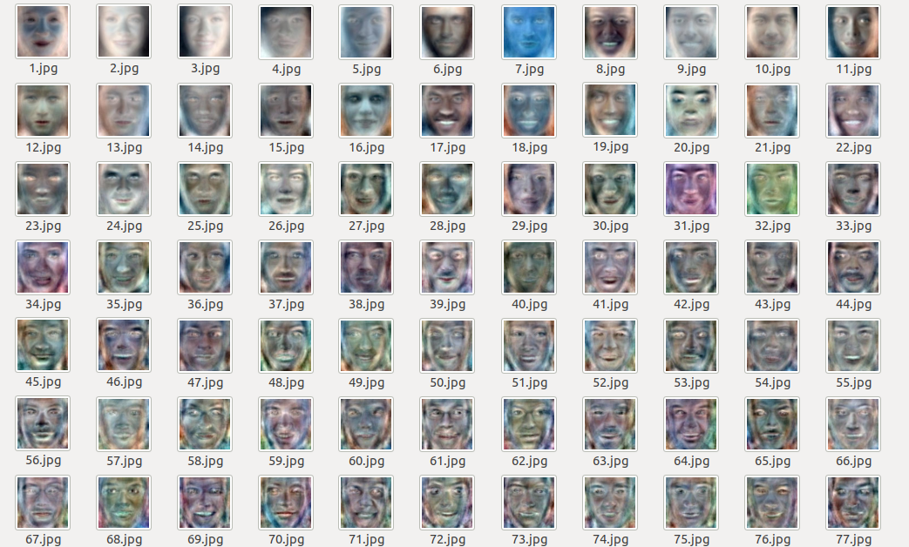
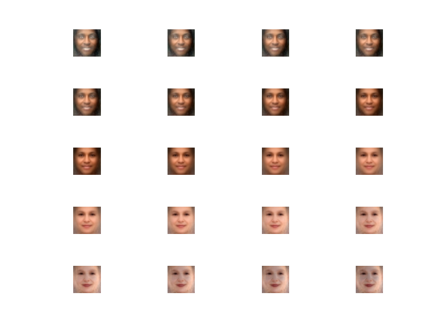
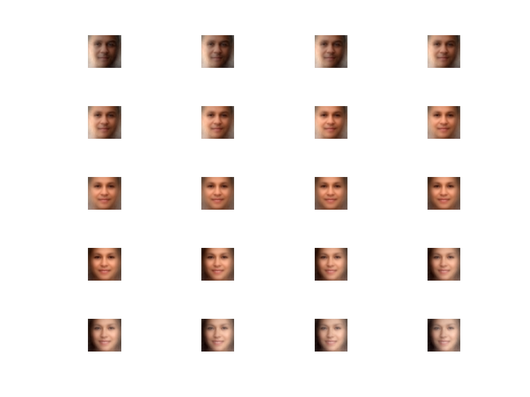
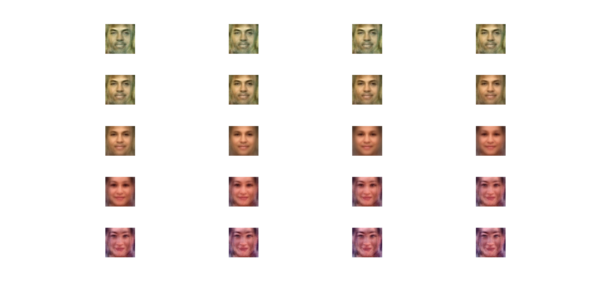

# PCA for Colored Face Images

Applying PCA to colored face images, and visulaizing variation of mean image in direction of PCA vectors and noting the feature learned in that direction.

## Code Requirements
- MatLab/Octave
- If you face any problem, kindly raise an issue.

## Data set used
- Chosen 500 random images from UTK Face Cropped: https://www.kaggle.com/abhikjha/utk-face-cropped
-- colored face images
-- well cropped faces
-- small resolution
-- good variance in age, gender, ethinicity etc.

## Setup

1) Need Matlab/Octave

## Execution

- Run pca_training.m
  - Loading Image ...
  - Subtracting mean Image from all images ...
  - Finding PCA ...
  - saving PCA ...
  - Saving PCA vectors as Image ...
- Run pca_visualization.m (Choose vector number, vecNo inside the code: Line number 4)
  - Loading PCA Vectors...
  - Loading PCA eigen values...
  - Loading PCA eigen values...

## Results

- It will save Pricipal components images (popularly named as ghost images) in pca_images folder.

- Visualization of variation of mean image in direction of PCA vectors will be saved in same folder.
- It is amazing that PCA can learn complex features as PCA vectors.
- Ethnicity and gender change in direction of vector 2

- Light direction, smile and gender change in direction of vector 3

- Ethnicity, smile and gender change in direction of vector 31

## Future Scope
- Adding User Interface using Python/MatLab
